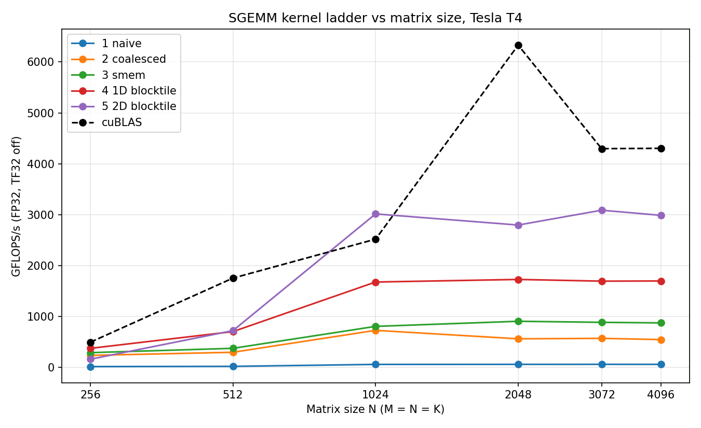

# kernel optimizations

Hand-written CUDA kernels, each optimized step by step and benchmarked against a hardware ceiling or a library baseline (cuBLAS). Everything below was measured on a Tesla T4.

## Results

### Parallel reduction
2^28 int32 elements, 256 threads/block. Measured peak bandwidth: 278.17 GB/s

| Kernel | Time (ms) | Bandwidth (GB/s) | Step speedup | Cumulative |
|---|:---:|:---:|:---:|:---:|
| 1: interleaved (divergent) | 18.4270 | 58.3 | | |
| 2: interleaved (bank conflicts) | 14.4062 | 74.5 | 1.28x | 1.28x |
| 3: sequential addressing | 12.0862 | 88.8 | 1.19x | 1.52x |
| 4: first add during load | 6.6745 | 160.9 | 1.81x | 2.76x |
| 5: unroll last warp | 5.3795 | 199.6 | 1.24x | 3.43x |
| 6: completely unrolled | 4.6441 | 231.2 | 1.16x | 3.97x |
| 7: multiple elements/thread | 4.2645 | 251.8 | 1.09x | 4.32x |

### SGEMM
<p align="center">
  
</p>

## Where things are

| Path | What it is |
|---|---|
| [kernels_impl/reduction/](kernels_impl/reduction) | `reduce1.cu` … `reduce7.cu`, each one adds one optimization to the previous |
| [kernels_impl/SGEMM/](kernels_impl/SGEMM) | naive → coalesced → shared mem → 1D blocktile → 2D blocktile |
| [reduce_report.py](reduce_report.py) | Builds and runs all reduction kernels and prints the table above |
| [run.py](run.py) | Builds one SGEMM kernel, checks it against `torch.matmul`, times it vs cuBLAS |
| [plots/bench_plot_sgemm.py](plots/bench_plot_sgemm.py) | Sweeps SGEMM kernels over matrix sizes and produces the plot |
| [ceilings.py](ceilings.py) | Measures the GPU's achievable memory bandwidth and FP32 throughput (roofline ceilings) |
| [gpu_props.cu](gpu_props.cu) | Prints device properties (SM count, smem, registers) |
| [notes.md](notes.md) | Roofline math and analysis notes |

## Reproduce

```bash
python ceilings.py                 # hardware ceilings
python reduce_report.py --n 28     # reduction table
python run.py --kernel sgemm_naive --M 4096 --N 4096 --K 4096
python plots/bench_plot_sgemm.py   # SGEMM plot
```

Requires an NVIDIA GPU, CUDA toolkit, and PyTorch. Results will vary by GPU and clocks; the numbers above are from a single T4 session.

## References
- Reduction: Mark Harris, *Optimizing Parallel Reduction in CUDA* (NVIDIA)

